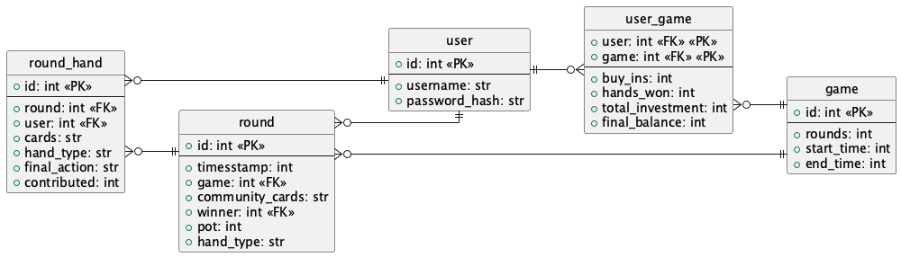

# Poker

This is a simple poker game implemented using express with an sqlite database to store previous game and using websockets to handle the game logic. All previous games are stored in a database to present the statistics.



## TODO

- [ ] implement users
  - [ ] at first, just use a simple username input to log in with no authentication at all
  - [ ] use username instead of socket id
  - [ ] implement proper auth with a database, jsonwebtoken etc. at this stage, use the user ID with a token for authentication to store the players in a game instead of the username directly. This will prevent players impersonating someone else by sending a different username, as it also will require the token.
  - [ ] persist the state when reloading the page (this would be fixed by using a username instead of assigning a new one from the socket ID every reload)
  - [ ] don't leave the game when exiting, but keep the player joined until they leave. maybe detect disconnection and set it to automatically check / fold until they rejoin, and completely skip the player for the next round.
- [ ] allow spectating the game - make the `gameId` websocket independent of whether or not the player has joined, so it is possible to see the state of an unjoined game.
- [ ] make the admin user stay as an admin even if they leave the game. there should be two joined-stages where the first is being just in the game and the second being a player. The admin should still be able to change settings and stuff even if they have no money.
- [ ] when creating a game, automatically join it
- [x] add an admin user to the game (the user who creates it)
  - [x] show a form before joining
  - [x] add an "awaiting approval" state for the owner to approve joining users
- [ ] make the 404 pages prettier
- [x] display the card SVGs (in gruvbox preferably) https://cardmeister.github.io/index.html
  - [ ] add a 4-color option

## Attributions

- Playing card SVGs (unlicense): https://github.com/cardmeister/cardmeister.github.io

## Run locally

```sh
bun install
bun run dev
```

(not tested with node)
