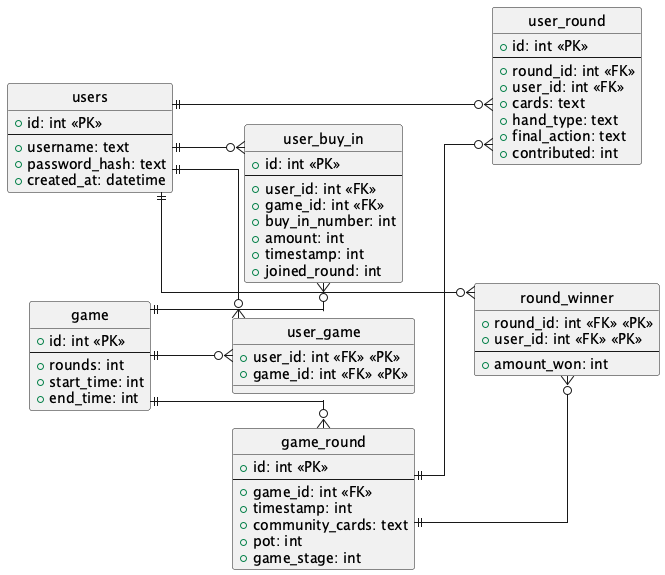

# Poker

This is a simple poker game implemented using express with an sqlite database to store previous game and using websockets to handle the game logic. All previous games are stored in a database to present the statistics.



## Personvernserklæring (GDPR)

Denne appen samler kun inn brukernavnet som informasjon som er mulig å knytte til brukeren. Dette brukes i systemet til å holde styr på hvilke brukere som har deltatt i spillrundene og å vise statistikk. Dette lagres i databasen som tekst, og kan på ingen måte knyttes til personen med mindre det er oppgitt i navnet. Jeg anbefaler derfor at brukere ikke skriver personopplysninger i brukernavnet sitt. Dette lagres som tekst i databasen. I tillegg lagres en kryptert versjon av passordet som ikke er mulig for andre å lese. Data som samles inn brukes kun til de essensielle funksjonalitetene til programmet, deriblant å delta i spill.

Dersom en bruker ønsker å få brukeren sin fjernet fra plattformen, er dette fullstendig mulig ved å gå inn i databasen og fjerne de relevante radene (`ON DELETE CASCADE`). For å slette data må man ta kontakt med systemadministratoren.

Dataen lagres på en sikker maskin der ingen uautoriserte har fysisk tilgang.

## Ruter

### `/` - hovedside

Inneholder leaderboard og innloggingsskjema, samt skjema for å bli med i eller opprette et nytt spill.

### `/game/:id` - Aktivt spill

### `/user/:id` - Detaljert spillerinformasjon

### `/games/:id` - Oppsummering av spill

## API

### POST `/signup`

Create a new user. Provide `username` and `password` in the request body.

### POST `/login`

Log in to an existing user. Provide `username` and `password` in the request body.

### POST `/logout`

Clear all authentication cookies and log out.

### POST `/new-game`

Oppretter et nytt spill og videresender brukeren til dette spillet.

### POST `/join-game`

Body inneholder en string `gameId`. Brukeren videresendes til spillet.

### POST `/api/games/:gameId/join`

Send en forespørsel til spillets administrator om å bli med. Om man er første som blir med, blir man automatisk godtatt og blir administrator.

### GET `/api/leaderboard`

List of all users ordered by their total profit.

### GET `/api/user/:id`

Information and statistics about a specific user. This includes the games they have played and various statistics about all games.

### GET `/api/game/:id`

Information about a specific game.

## Attributions

- Playing card SVGs (unlicense): https://github.com/cardmeister/cardmeister.github.io

## Run locally

```sh
bun install
bun run dev
```

> [!NOTE]
> This required bun to work, and will not run in node without modifications!
